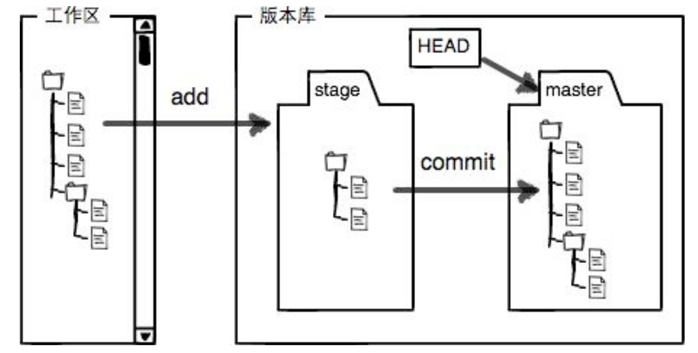

ubuntu下用hexo写博客,借机学习了一下git,感觉还是很强大的管理系统,这里记录一下git常用的基础命令,随时添加.
<!-- more -->
工作区 暂存区 仓库关系
 
``` bash
//初始化git
git init 
//添加文件到暂存区
git add.
//提交文件到仓库
git commit -m "x"
//查看工作状态
git status
//比较不同
git diff
//查看日志
git log
git log --pretty=oneline
//回退一个版本
git reset --hard HEAD^
//回退版本 编号 3628164
git reset --hard 3628164
//命令记录
git reflog
//创建SSH Key id_rsa.pub公钥
ssh-keygen -t rsa -C "youremail@example.com"
//关联远程仓库
git remote add origin git@github.com:michaelliao/learngit.git
//推送master到origin
git push origin master
//同步远程到master
git pull origin master
//同步到本地
git clone git@github.com:michaelliao/gitskills.git
//创建+切换分支
git checkout -b <name>
//查看分支
git branch
//切换分支
git checkout <name>
``` 

