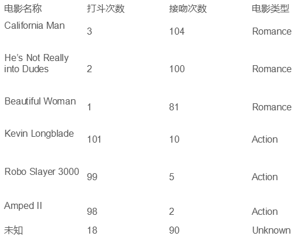
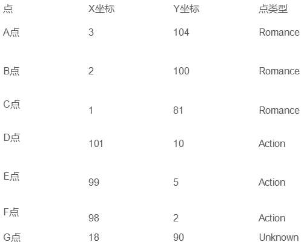
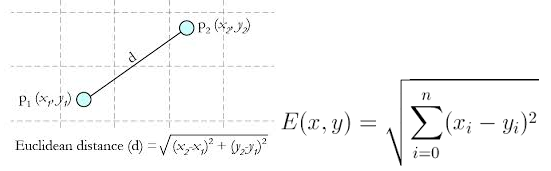
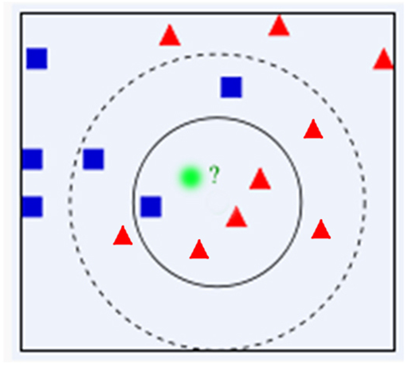
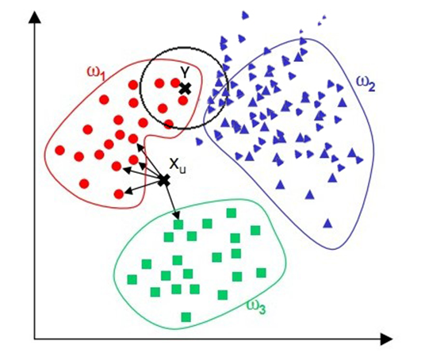

1. 综述
1.1Cover和Hart在1968年提出了最初的邻近算法
1.2分类(classification)算法
1.3输入基于实例的学习(instance-based learning), 懒惰学习(lazy learning)
2. 例子：

<!-- more -->未知电影属于什么类型？

3. 算法详述
3.1步骤：
为了判断未知实例的类别，以所有已知类别的实例作为参照
选择参数K
计算未知实例与所有已知实例的距离
选择最近K个已知实例
根据少数服从多数的投票法则(majority-voting)，让未知实例归类为K个最邻近样本中最多数的类别
3.2细节:
关于K
关于距离的衡量方法:
3.2.1Euclidean Distance 定义
               
其他距离衡量：余弦值（cos）, 相关度 （correlation）, 曼哈顿距离 （Manhattan distance）           
3.3举例
  
4. 算法优缺点：

4.1算法优点
简单
易于理解
容易实现
通过对K的选择可具备丢噪音数据的健壮性
4.2算法缺点   需要大量空间储存所有已知实例
算法复杂度高（需要比较所有已知实例与要分类的实例）
当其样本分布不平衡时，比如其中一类样本过大（实例数量过多）占主导的时候，新的未知实例容易被归类为这个主导样本，因为这类样本实例的数量过大，但这个新的未知实例实际并木接近目标样本
5. 改进版本
考虑距离，根据距离加上权重
比如: 1/d (d: 距离）

