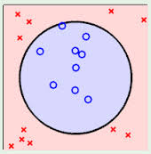
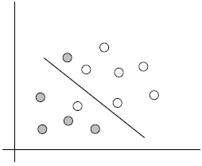

1. 背景：
1.1 最早是由 Vladimir N. Vapnik 和 Alexey Ya. Chervonenkis 在1963年提出
1.2 目前的版本(soft margin)是由Corinna Cortes 和 Vapnik在1993年提出，并在1995年发表
1.3 深度学习（2012）出现之前，SVM被认为机器学习中近十几年来最成功，表现最好的算法
2. 机器学习的一般框架：
训练集 => 提取特征向量 => 结合一定的算法（分类器：比如决策树，KNN）=>得到结果
3. 介绍：
3.1例子：

两类？哪条线最好？
<!-- more -->
3.2SVM寻找区分两类的超平面（hyper plane), 使边际(margin)最大

总共可以有多少个可能的超平面？无数条
如何选取使边际(margin)最大的超平面 (Max Margin Hyperplane)？
超平面到一侧最近点的距离等于到另一侧最近点的距离，两侧的两个超平面平行
3.3线性可区分(linear separable) 和 线性不可区分 （linear inseparable) 

上图皆为线性不可区分
4. 定义与公式建立
超平面可以定义为：$W\dot X+b=0$
W: weight vectot,$W$={$w_1,w_2,\cdots,w_n$} , n 是特征值的个数
X: 训练实例
b: bias
4.1假设2维特征向量：X = (x1, X2)
把 b 想象为额外的 wight
超平面方程变为： $w_0+w_1x_1+w_2x_2=0$
所有超平面右上方的点满足：$w_0+w_1x_1+w_2x_2>0$
所有超平面左下方的点满足： $w_0+w_1x_1+w_2x_2<0$
调整weight，使超平面定义边际的两边：
$H1:w_0+w_1x_1+w_2x_2\ge  1 \text{for} y_i=+1$
$H2:w_0+w_1x_1+w_2x_2\le  -1 \text{for} y_i=-1$
综合以上两式，
得到：$y_i(w_0+w_1x_1+w_2x_2)\ge 1,\forall i$（1）
所有坐落在边际的两边的的超平面上的被称作”支持向量(support vectors)"
分界的超平面和H1或H2上任意一点的距离为 $\frac{1}{||w||}$ (i.e.: 其中||W||是向量的范数(norm))
所以，最大边际距离为：$\frac{2}{||w||}$  
5. 求解
5.1SVM如何找出最大边际的超平面呢(MMH)？
利用一些数学推倒，以上公式 （1）可变为有限制的凸优化问题(convex quadratic optimization)
利用 Karush-Kuhn-Tucker (KKT)条件和拉格朗日公式，可以推出MMH可以被表示为以下“决定边界 (decision boundary)”  
$d(X^T)=\sum{y_i\alpha_iX_iX^T}+b_0$        
其中，
$y_i$ 是支持向量点
$X_i$（support vector)的类别标记（class label)
$X^T$是要测试的实例
$\alpha _i$ 和 $b_0$ 都是单一数值型参数，由以上提到的最有算法得出
$l$ 是支持向量点的个数
5.2对于任何测试（要归类的）实例，带入以上公式，得出的符号是正还是负决定
6. 例子：

