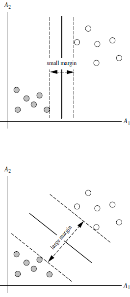

1. SVM算法特性：

1.1训练好的模型的算法复杂度是由支持向量的个数决定的，而不是由数据的维度决定的。所以SVM不太容易产生overfitting
1.2SVM训练出来的模型完全依赖于支持向量(Support Vectors), 即使训练集里面所有非支持向量的点都被去除，重复训练过程，结果仍然会得到完全一样的模型。
1.3一个SVM如果训练得出的支持向量个数比较小，SVM训练出的模型比较容易被泛化。
<!-- more -->
2. 线性不可分的情况 （linearly inseparable case)

2.1数据集在空间中对应的向量不可被一个超平面区分开
2.2两个步骤来解决：
2.2.1利用一个非线性的映射把原数据集中的向量点转化到一个更高维度的空间中
2.2.2在这个高维度的空间中找一个线性的超平面来根据线性可分的情况处理

2.2.3视觉化演示 https://www.youtube.com/watch?v=3liCbRZPrZA
2.3如何利用非线性映射把原始数据转化到高维中？
2.3.1 例子：
3维输入向量：$X=${$x_1,x_2,x_3$)
转化到6维空间 Z 中去：
$\phi_1(X)=x1,\phi_2(X)=x2,\phi_3(X)=x3,\phi_4(X)=x1^2,\phi_5(X)=x1x2,\phi_6(X)=x1x3$ 
新的决策超平面： $d(Z)=WZ+b$ 其中W和Z是向量，这个超平面是线性的
解出W和b之后，并且带入回原方程：
d(Z)=w1x1+w2x2+w3x3+$w4x1^2$+w5x1x2+w3x1x3+b
    =w1z1+w2z2+w3z3+w4z4+w5z5+w6z6+b
2.3.2思考问题：
2.3.2.1如何选择合理的非线性转化把数据转到高纬度中？
2.3.2.2如何解决计算内积时算法复杂度非常高的问题？
2.3.3使用核方法（kernel trick)
3. 核方法（kernel trick)
3.1动机
在线性SVM中转化为最优化问题时求解的公式计算都是以内积(dot product)的形式出现的$\phi(X_i)\phi(X_j)$，其中$\phi(x)$是把训练集中的向量点转化到高维的非线性映射函数，因为内积的算法复杂度非常大，
所以我们利用核函数来取代计算非线性映射函数的内积
3.1以下核函数和非线性映射函数的内积等同
$K(X_i,X_j)=\phi(X_i)\phi(X_j)$
3.2  常用的核函数(kernel functions)
h度多项式核函数(polynomial kernel of degree h)：  $K(X_i,X_j)=(X_iX_j+1)^n$          
高斯径向基核函数(Gaussian radial basis function kernel):  $K(X_i,X_j)=e^{-||X_i-X_j||^2/2\sigma^2}$
S型核函数(Sigmoid function kernel):   $K(X_i,X_j)=tanh(\alpha X_iX_j-\delta)$                            
如何选择使用哪个kernel？
根据先验知识，比如图像分类，通常使用RBF，文字不使用RBF
尝试不同的kernel，根据结果准确度而定
3.3  核函数举例:
假设定义两个向量： x = (x1, x2, x3); y = (y1, y2, y3)
定义方程：f(x) = (x1x1, x1x2, x1x3, x2x1, x2x2, x2x3, x3x1, x3x2, x3x3)
K(x, y ) = (xy)^2
假设x = (1, 2, 3); y = (4, 5, 6). 
f(x) = (1, 2, 3, 2, 4, 6, 3, 6, 9)
f(y) = (16, 20, 24, 20, 25, 36, 24, 30, 36)
<f(x), f(y)> = 16 + 40 + 72 + 40 + 100+ 180 + 72 + 180 + 324 = 1024
K(x, y) = (4  + 10 + 18 ) ^2 = 32^2 = 1024
同样的结果，使用kernel方法计算容易很多
4. SVM扩展可解决多个类别分类问题
对于每个类，有一个当前类和其他类的二类分类器（one-vs-rest)