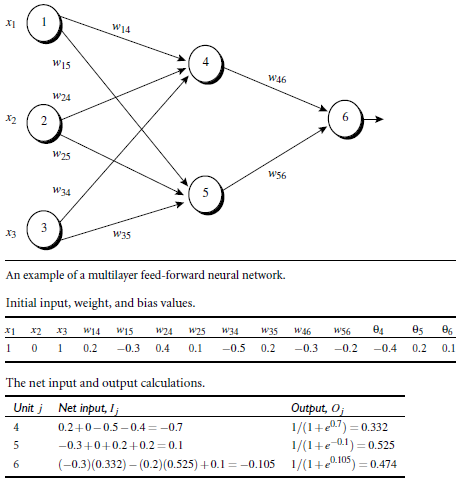

1. 背景:
1.1以人脑中的神经网络为启发，历史上出现过很多不同版本
1.2最著名的算法是1980年的 backpropagation 
2. 多层向前神经网络(Multilayer Feed-Forward Neural Network)
2.1Backpropagation被使用在多层向前神经网络上
2.2多层向前神经网络由以下部分组成：
<!-- more -->
输入层(input layer), 隐藏层 (hidden layers), 输入层 (output layers)

2.3每层由单元(units)组成
2.4输入层(input layer)是由训练集的实例特征向量传入
2.5经过连接结点的权重(weight)传入下一层，一层的输出是下一层的输入
2.6隐藏层的个数可以是任意的，输入层有一层，输出层有一层
2.7每个单元(unit)也可以被称作神经结点，根据生物学来源定义
2.8以上成为2层的神经网络（输入层不算）
2.8一层中加权的求和，然后根据非线性方程转化输出
2.9作为多层向前神经网络，理论上，如果有足够多的隐藏层(hidden layers) 和足够大的训练集, 可以模拟出任何方程
3. 设计神经网络结构
3.1使用神经网络训练数据之前，必须确定神经网络的层数，以及每层单元的个数
3.2特征向量在被传入输入层时通常被先标准化(normalize）到0和1之间 （为了加速学习过程）
3.3离散型变量可以被编码成每一个输入单元对应一个特征值可能赋的值
比如：特征值A可能取三个值（a0, a1, a2), 可以使用3个输入单元来代表A。
如果A=a0, 那么代表a0的单元值就取1, 其他取0；
如果A=a1, 那么代表a1de单元值就取1，其他取0，以此类推
3.4神经网络即可以用来做分类(classification）问题，也可以解决回归(regression)问题
3.4.1对于分类问题，如果是2类，可以用一个输出单元表示（0和1分别代表2类）
如果多余2类，每一个类别用一个输出单元表示
所以输入层的单元数量通常等于类别的数量
3.4.2没有明确的规则来设计最好有多少个隐藏层
3.4.2.1根据实验测试和误差，以及准确度来实验并改进
4. 交叉验证方法(Cross-Validation)

K-fold cross validation 
5. Backpropagation算法
5.1通过迭代性的来处理训练集中的实例
5.2对比经过神经网络后输入层预测值(predicted value)与真实值(target value)之间
5.3反方向（从输出层=>隐藏层=>输入层）来以最小化误差(error)来更新每个连接的权重(weight)
5.4算法详细介绍
输入：D：数据集，l 学习率(learning rate)， 一个多层前向神经网络
输入：一个训练好的神经网络(a trained neural network)
5.4.1初始化权重(weights)和偏向(bias): 随机初始化在-1到1之间，或者-0.5到0.5之间，每个单元有          
一个偏向
5.4.2对于每一个训练实例X，执行以下步骤：
5.4.2.1:由输入层向前传送

$I_j=\sum_i w_{ij}O_i+\theta j$

$O_j=\frac{1}{1+e^{I_j}}$
5.4.2.2根据误差(error)反向传送
对于输出层：
$Err_j=O_j(1-O_j)(T_j-O_j)$
对于隐藏层：
$Err_j=O_j(1-O_j)\sum{Err_kw_{jk}}$
$\bigtriangleup w_{ij}=(l) Err_jO_i$
权重更新：
$w_{ij}=w_{ij}+\bigtriangleup w_{ij}$  
偏向更新    
$\bigtriangleup \theta_j=(l) Err_j$ 
$\theta_j=\theta_j+\bigtriangleup \theta_j$ 
5.4.3终止条件
5.4.3.1权重的更新低于某个阈值
5.4.3.2预测的错误率低于某个阈值
5.4.3.3达到预设一定的循环次数
6.  Backpropagation 算法举例

对于输出层：
$Err_j=O_j(1-O_j)(T_j-O_j)$
对于隐藏层：
$Err_j=O_j(1-O_j)\sum{Err_kw_{jk}}$
$\bigtriangleup w_{ij}=(l) Err_jO_i$
权重更新：
$w_{ij}=w_{ij}+\bigtriangleup w_{ij}$  
偏向更新    
$\bigtriangleup \theta_j=(l) Err_j$ 
$\theta_j=\theta_j+\bigtriangleup \theta_j$ 

