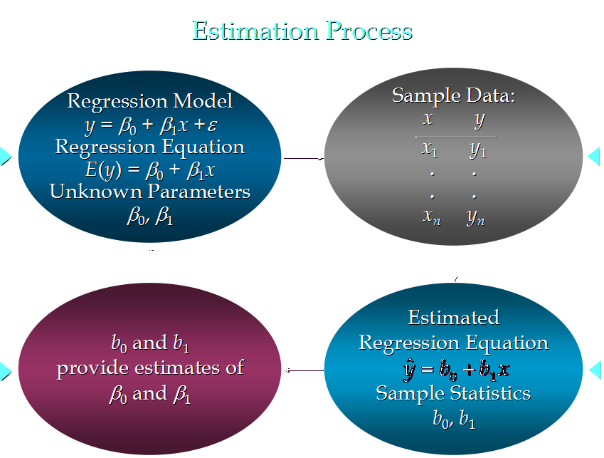

1. 为什么需要统计量？
统计量：描述数据特征
1.1集中趋势衡量
1.1.1均值（平均数，平均值）（mean）
$\overline x = \sum_{i=1}^{n}x_i$
{6, 2, 9, 1, 2}
(6 + 2 + 9 + 1 + 2) / 5 = 20 / 5 = 4
1.1.2中位数 （median）: 将数据中的各个数值按照大小顺序排列，居于中间位置的变量
1.1.2.1给数据排序：1， 2， 2， 6， 9
1.1.2.2找出位置处于中间的变量：2
当n为基数的时候：直接取位置处于中间的变量
当n为偶数的时候，取中间两个量的平均值
1.1.2众数 （mode）：数据中出现次数最多的数
<!-- more -->
1.2
1.2.1离散程度衡量
1.2.1.1方差（variance)
$s^2=\frac{\sum_{i=1}^n(x_i-\overline x)^2}{n-1}$
{6, 2, 9, 1, 2}
(1) (6 - 4)^2 + (2 - 4) ^2 + (9 - 4)^2 + (1 - 4)^2 + (2 - 4)^2 
   = 4 + 4 + 25 + 9 + 4
   = 46
(2) n - 1 = 5 - 1 = 4
(3) 46 / 4 = 11.5
1.2.1.2标准差 (standard deviation)
$s=\sqrt{s^2}$
s = sqrt(11.5) = 3.39  
2. 简单线性回归(Simple Linear Regression)
2.1很多做决定过过程通常是根据两个或者多个变量之间的关系
2.2回归分析(regression analysis)用来建立方程模拟两个或者多个变量之间如何关联
2.3被预测的变量叫做：因变量(dependent variable), y, 输出(output)
2.4被用来进行预测的变量叫做： 自变量(independent variable), x, 输入(input)
3. 简单线性回归介绍
3.1简单线性回归包含一个自变量(x)和一个因变量(y)
3.2以上两个变量的关系用一条直线来模拟
3.3如果包含两个以上的自变量，则称作多元回归分析(multiple regression)
4. 简单线性回归模型
4.1被用来描述因变量(y)和自变量(X)以及偏差(error)之间关系的方程叫做回归模型
4.2简单线性回归的模型是:
$y=\beta_0+\beta_1x+\varepsilon$     
5. 简单线性回归方程
E(y) = β0+β1x 
这个方程对应的图像是一条直线，称作回归线
其中，β0是回归线的截距
β1是回归线的斜率  
E(y)是在一个给定x值下y的期望值（均值）
6. 正向线性关系：
   
7. 负向线性关系：

8. 无关系

9. 估计的简单线性回归方程
ŷ=b0+b1x
这个方程叫做估计线性方程(estimated regression line)
其中，b0是估计线性方程的纵截距
b1是估计线性方程的斜率
ŷ是在自变量x等于一个给定值的时候，y的估计值
10. 线性回归分析流程：
    
11. 关于偏差ε的假定
11.1是一个随机的变量，均值为0
11.2ε的方差(variance)对于所有的自变量x是一样的
11.3ε的值是独立的
11.4ε满足正态分布
                    