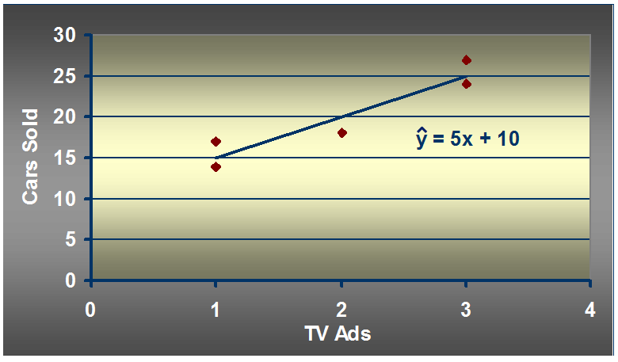

1. 简单线性回归模型举例：
汽车卖家做电视广告数量与卖出的汽车数量：
 
1.1 如何练处适合简单线性回归模型的最佳回归线？
<!-- more -->  
  
min$\sum(y_i-\hat y_i)^2$
使sum of squares最小
1.1.2 计算
  
$b_1=\frac{\sum(x_i-\overline x)(y_i-\overline y)}{\sum(x_i-\overline x)^2}$
$b_0=\overline y-b_1\overline x$
分子 = (1-2)(14-20)+(3-2)(24-20)+(2-2)(18-20)+(1-2)(17-20)+(3-2)(27-20)
= 6 + 4 + 0 + 3 + 7
= 20
分母 = （1-2）^2 + (3-2)^2 + (2-2)^2 + (1-2)^2 + (3-2)^2
= 1 + 1 + 0 + 1 + 1
= 4
b1 = 20/4  =5
b0 = 20 - 5$\times$2 = 20 - 10 = 10
1.2 预测：
假设有一周广告数量为6，预测的汽车销售量是多少？
  
x_given = 6
Y_hat = 5$\times$6 + 10 = 40
1.3 Python实现：
``` bash
import numpy as np
def fitSLR(x, y):
    n = len(x)
    dinominator = 0
    numerator = 0
    for i in range(0, n):
        numerator += (x[i] - np.mean(x))*(y[i] - np.mean(y))
        dinominator += (x[i] - np.mean(x))**2
    b1 = numerator/float(dinominator)
    b0 = np.mean(y)-b1*float(np.mean(x))
    return b0, b1
def predict(x, b0, b1):
    return b0 + x*b1
x = [1, 3, 2, 1, 3]
y = [14, 24, 18, 17, 27]    
b0, b1 = fitSLR(x, y)
print "intercept:", b0, " slope:", b1
x_test = 6
y_test = predict(6, b0, b1)
print "y_test:", y_test
```