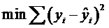

1. 与简单线性回归区别(simple linear regression)
多个自变量(x)
2. 多元回归模型
y=β0＋β１x1+β2x2+ ... +βpxp+ε
其中：β0，β１，β2... βp是参数
ε是误差值
3. 多元回归方程
E(y)=β0＋β１x1+β2x2+ ... +βpxp
4. 估计多元回归方程:
y_hat=b0＋b１x1+b2x2+ ... +bpxp
一个样本被用来计算β0，β１，β2... βp的点估计b0, b1, b2,..., bp
<!-- more --> 
5. 估计流程  (与简单线性回归类似）
  
6. 估计方法
使sum of squares最小    
 
运算与简单线性回归类似，涉及到线性代数和矩阵代数的运算
7. 例子
一家快递公司送货：X1： 运输里程 X2： 运输次数   Y：总运输时间   
Driving 
Assignment Traveled	X1=Miles X2=Number of Deliveries Y= Travel Time (Hours)	
1	100	4	9.3
2	50	3	4.8
3	100	4	8.9
4	100	2	6.5
5	50	2	4.2
6	80	2	6.2
7	75	3	7.4
8	65	4	6.0
9	90	3	7.6
10	90	2	6.1
Time = b0+ b1*Miles + b2 * Deliveries 
Time = -0.869 + 0.0611 Miles + 0.923 Deliveries
8. 描述参数含义
b0: 平均每多运送一英里，运输时间延长0.0611 小时
b1: 平均每多一次运输，运输时间延长 0.923 小时
9. 预测
如果一个运输任务是跑102英里，运输6次，预计多少小时？
Time = -0.869 +0.0611 *102+ 0.923 * 6
= 10.9 (小时）
10. 如果自变量中有分类型变量(categorical data) , 如何处理？
英里数	次数	车型	时间
100	4	1	9.3
50	3	0	4.8
100	4	1	8.9
100	2	2	6.5
50	2	2	4.2
80	2	1	6.2
75	3	1	7.4
65	4	0	6
90	3	0	7.6
11. 关于误差的分布
误差ε是一个随机变量，均值为0
ε的方差对于所有的自变量来说相等
所有ε的值是独立的
ε满足正态分布，并且通过β0＋β１x1+β2x2+ ... +βpxp反映y的期望值