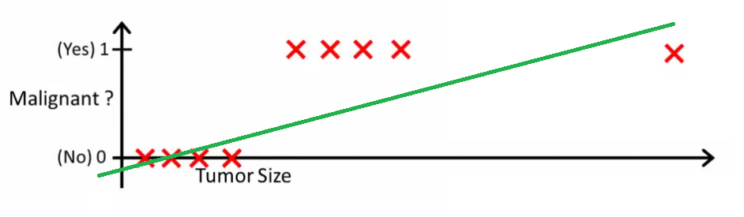

1. 概率：
1.1 定义   概率(P)robability: 对一件事情发生的可能性的衡量
1.2 范围   0 <= P <= 1
1.3 计算方法： 
1.3.1 根据个人置信
1.3.2 根据历史数据
1.3.3 根据模拟数据
<!-- more --> 
1.4 条件概率：
$P(A|B)=\frac{P(A\cap B)}{P(B)}$                         
2. Logistic Regression (逻辑回归)
2.1 例子
                      
h(x) > 0.5
             
h(x) > 0.2
2.2 基本模型
测试数据为X(x0，x1，x2···xn)
要学习的参数为： Θ(θ0，θ1，θ2，···θn) 
$Z=\theta_0 x_0+\theta_1 x_1\theta_2 x_2+\cdots \theta_n x_n$   
向量表示
$Z=\Theta^TX$   
处理二值数据，引入Sigmoid函数时曲线平滑化
$g(Z)=\frac{1}{1+e^{-Z}}$   
预测函数:
$h_\theta(X)=g(\Theta^TX)=\frac{1}{1+e^{-\Theta^TX}}$  
 用概率表示:
正例(y=1): 
$h_\theta(X)=P(y=1|X;\Theta)$   
反例(y=0): 
$1-h_\theta(X)=P(y=0|X;\Theta)$   
2.3 Cost函数
线性回归: 
 
$\sum_{i=1}^m(h_\theta (x^{(i)})-y^{(i)})^2$ 
$h_\theta(x^{(i)})=\theta_0+\theta_1x^{(i)}$ 
找到合适的 θ0，θ1使上式最小
Logistic regression: 
 
Cost函数: 
目标：找到合适的 θ0，θ1使上式最小
2.4 解法：梯度下降（gradient decent)
  
$\theta_j=\theta_j-\alpha\frac{\partial}{\partial\theta_j}J(\theta),(j=0\cdots n)$ 
更新法则: 
$\theta_j=\theta_j-\alpha \sum_{i=1}^m(h_\theta (x^{(i)})-y^{(i)})x_j^{(i)},(j=0\cdots n)$   
学习率
同时对所有的θ进行更新
重复更新直到收敛   