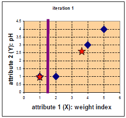
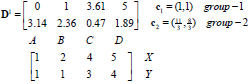

1. 归类： 
聚类(clustering) 属于非监督学习 (unsupervised learning)
无类别标记(class label)
2. 举例：
 
<!-- more -->          
3. K-means 算法：
3.1 Clustering 中的经典算法，数据挖掘十大经典算法之一
3.2 算法接受参数 k ；然后将事先输入的n个数据对象划分为 k个聚类以便使得所获得的聚类满足：同一聚类中的对象相似度较高；而不同聚类中的对象相似度较小。
3.3 算法思想：
以空间中k个点为中心进行聚类，对最靠近他们的对象归类。通过迭代的方法，逐次更新各聚类中心的值，直至得到最好的聚类结果
3.4 算法描述：         
（1）适当选择c个类的初始中心；
（2）在第k次迭代中，对任意一个样本，求其到c各中心的距离，将该样本归到距离最短的中心所在的类；
（3）利用均值等方法更新该类的中心值；
（4）对于所有的c个聚类中心，如果利用（2）（3）的迭代法更新后，值保持不变，则迭代结束，否则继续迭代。
3.5 算法流程：
             
输入：k, data[n];
（1） 选择k个初始中心点，例如c[0]=data[0],…c[k-1]=data[k-1];
（2） 对于data[0]….data[n], 分别与c[0]…c[k-1]比较，假定与c[i]差值最少，就标记为i;
（3） 对于所有标记为i点，重新计算c[i]={ 所有标记为i的data[j]之和}/标记为i的个数；
（4） 重复(2)(3),直到所有c[i]值的变化小于给定阈值。
4. 举例：
   
 
 
 
 
 

 
 
 
   
停止        
优点：速度快，简单
缺点：最终结果跟初始点选择相关，容易陷入局部最优，需直到k值
Reference:http://croce.ggf.br/dados/K%20mean%20Clustering1.pdf