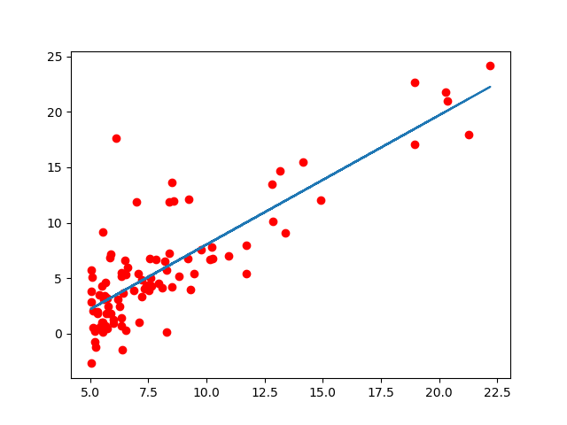
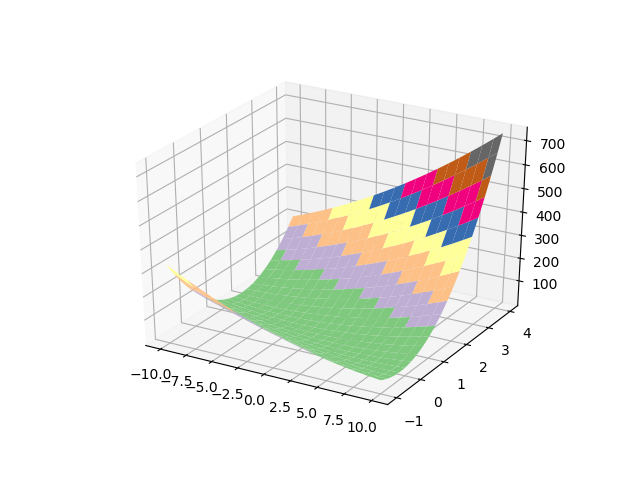
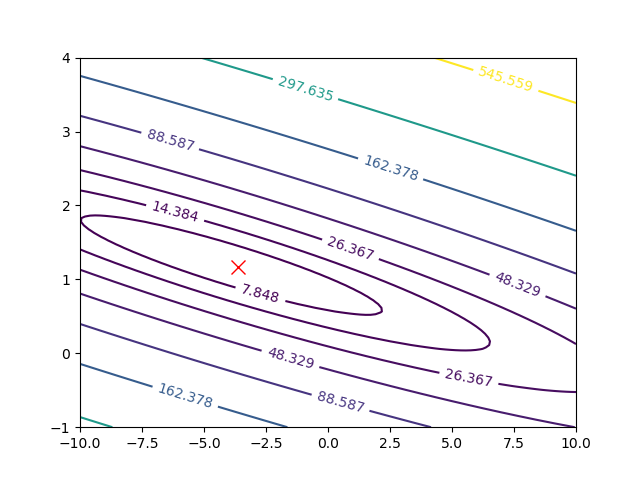
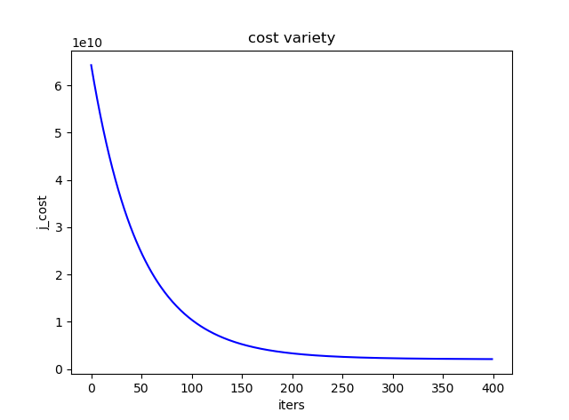

吴恩达机器学习课程ex1 python版本 代码上传的我的github上
单变量线性回归
梯度下降法：
学习速率与迭代次数：
iterations = 1500
alpha = 0.01
运行结果：
 
<!-- more -->
 

参数计算结果：
[[-3.63029144]
 [ 1.16636235]]
最小代价：
Cost computed = 4.483388
[代码](https://github.com/serenityd/Coursera-ML-Code/blob/master/ex1/ex1.py)

最小二乘法：
参数计算结果：
[[-3.89578088]
 [ 1.19303364]]
最小代价：
Cost computed = 4.47697138

[代码](https://github.com/serenityd/Coursera-ML-Code/blob/master/ex1/linear_regression_used_ls.py)
可见梯度下降得到的是一个相对最优的值 与学习速率和迭代次数有关系 在特征量不那么多（<10000）时采用最小二乘法效果较好

多变量线性回归
梯度下降法：
参数：
alpha = 0.01;
num_iters = 400;
运行结果：

参数计算结果：
[[ 334302.06399328]
 [  99411.44947359]
 [   3267.01285407]]
最小代价：
[[  2.10544829e+09]]
最小二乘法：
参数：
alpha = 0.01;
num_iters = 400;

参数计算结果：
[[ 340412.65957447]
 [ 109447.79646964]
 [  -6578.35485416]]
最小代价：
[[  2.04328005e+09]]
小于梯度下降法，经多次实验当梯度下降法参数选取适当时与最小二乘法结果相同
[代码](https://github.com/serenityd/Coursera-ML-Code/blob/master/ex1/ex1_mullr.py)
